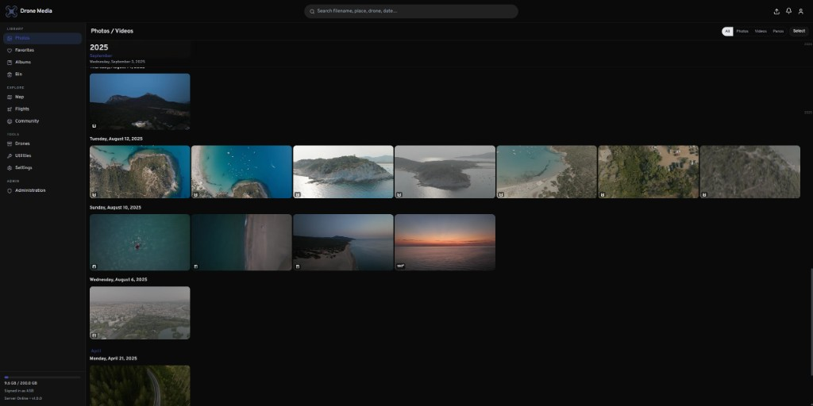
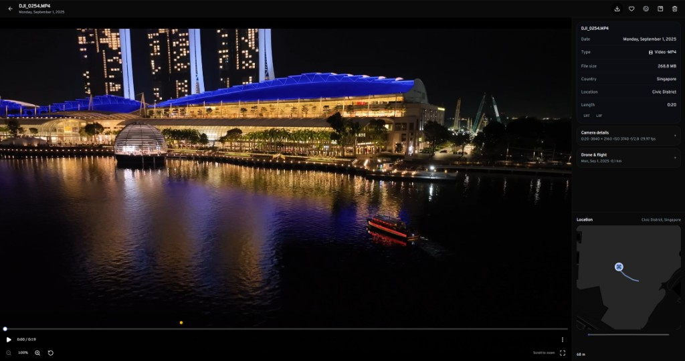
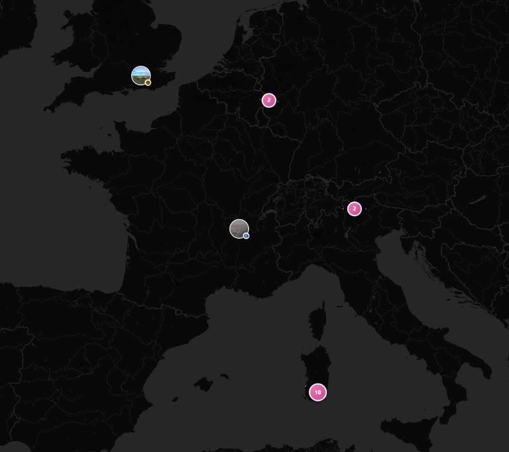
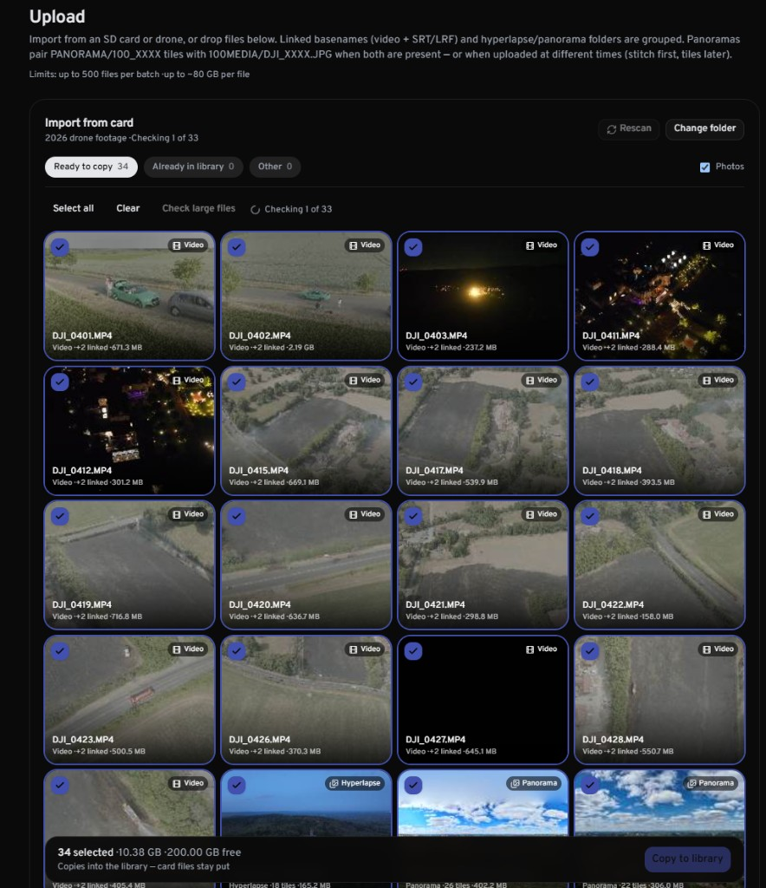
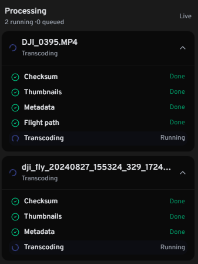

<p align="center">
  
</p>

<h1 align="center">Drone Media</h1>

<p align="center">
  <strong>Self-hosted library for drone photos, videos, and flight telemetry.</strong><br />
  Immich-like UX, built for DJI-style workflows — not a general photo app, not a movie server.
</p>

## What it is

Drone Media is a multi-user web app for keeping aerial media organized at home. Import from an SD card or folder, keep MP4 + SRT (+ LRF) grouped together, then browse a timeline, map, and flights with regenerable previews and HLS playback. Mark media public for **Community** profiles — there is no legacy share-link inbox.

## Who it’s for

- Drone pilots who want an Immich-style library aimed at flight media and telemetry
- Homelabbers running Docker next to Immich / Jellyfin / *arr stacks
- Small teams or households that need separate users, quotas, and admin tools

## Screenshots

### Timeline

Date-grouped photos and videos in the main library.



### Playback

Watch clips with metadata, linked SRT/LRF, and the telemetry path on a map.



### Map

Geotagged media on a world map, with clusters where shots overlap.



### Upload

Import from an SD card or drone folder — linked basenames and sequences are grouped before you copy into the library.



### Processing

Live job status after import: checksum, thumbnails, metadata, flight path, and transcoding.



## At a glance

- Chunked uploads with basename grouping (video + SRT + LRF, hyperlapse / panorama folders)
- Timeline, map, flights, albums, drones, favorites, and bin
- HLS adaptive playback from cache; **Source** in the player only after a streaming preview exists (download always available)
- Photo **Web** previews on cache; full originals for download
- Community profiles and a shared public map
- Admin: pause/enable heavy jobs (transcoding, panorama stitch) for bulk imports; enabling backfills media still missing those jobs
- Operator settings editable in **Admin → Settings** (upload limits, HLS ladder, quotas, and more)
- Admin: users, invites, integrity, storage, backups, failed jobs

---

## License

AGPL-3.0 — see [LICENSE](./LICENSE).

## Features

- **Library** — timeline, map, flights, albums, drones, favorites, bin
- **Playback** — HLS adaptive streaming (1080p / 1440p / Auto) from regenerable cache; **Source** plays the original from media storage
- **Photos** — in-app **Web** preview from cache; **Source** / download use full originals
- **Community** — discover public profiles and a shared map (`/community`); open media on `/u/{username}`
- **Admin** — users, invites, integrity, storage report, settings, backups, failed jobs; **Jobs** tab to pause/enable transcoding (and panorama stitch) globally, view all-users queues, and backfill when re-enabled
- **Upload** — chunked resumable uploads with basename grouping (MP4 + SRT + LRF)

While transcoding is paused, Live Processing finishes after metadata (no Transcoding spam). Users see deferred items under **Utilities → Jobs** as “Waiting to transcode.” Videos without a streaming preview show a status message instead of playing Source in the player.

There is **no** legacy share-link / “Shared inbox” flow. Visibility for others is via **Community** and assets marked public on your profile.

## Prerequisites

- Docker & Docker Compose (recommended for production)
- Node.js 22+ (local development only)

## Quick start (Docker)

1. Clone the repo and create an env file:

   ```bash
   cp .env.example .env
   ```

2. Edit **`.env`**:
   - `AUTH_SECRET` — long random string (required)
   - `PUBLIC_URL` — URL you open in the browser (e.g. `http://192.168.1.177:3384` or `https://dronemedia.example.com`)

3. Edit **`docker-compose.yml`** host paths (and ports if needed):
   - Postgres data → SSD (never under the cache directory)
   - **Redis data → SSD** (host bind; **not** a Docker named volume)
   - Cache → SSD (thumbnails, HLS, proxies, upload staging)
   - Media → HDD (originals)
   - App is published as **`3384:2283`** so it does **not** clash with Immich on **2283**
   - Postgres and Redis are **not** published to the host (compose network only)

4. Create the host directories, then start:

   ```bash
   # Example Linux layout — match paths in docker-compose.yml
   sudo mkdir -p /mnt/ssd1_system/docker/dronemedia/postgres \
     /mnt/ssd1_system/docker/dronemedia/redis \
     /mnt/ssd2_cache/dronemedia/cache \
     /mnt/hdd1_personal/dronemedia/media
   # Redis official image runs as uid 999 — required or RDB saves fail (MISCONF / login broken)
   sudo chown -R 999:999 /mnt/ssd1_system/docker/dronemedia/redis

   docker compose up -d --build
   ```

5. Open `PUBLIC_URL`. On first boot, the setup wizard creates the admin account.

**Always run both `app` and `worker`.** Without the worker: no thumbnails, HLS, photo web previews, or telemetry jobs.

### Useful commands

```bash
docker compose ps
docker compose logs -f app worker
docker compose restart worker
docker compose down   # data on bind mounts / volumes is kept
```

### Co-hosting with Immich / *arr / Jellyfin

| Service | Host port | Notes |
|---------|-----------|--------|
| Immich | **2283** | Leave alone |
| Drone Media | **3384** → container 2283 | Default in compose |
| Drone Media Postgres/Redis | *(none)* | Internal only; do not reuse Immich’s DB/Redis |

Point Nginx Proxy Manager (or similar) at `http://HOST:3384` (or the app container on a shared Docker network at port **2283**). For a custom domain, set `PUBLIC_URL=https://your.domain` to match.

## Storage tiers

| Tier | In-container path | Purpose |
|------|-------------------|---------|
| App | `/data/app` | LUTs, small app state (Docker volume by default) |
| Cache | `/data/cache` | Regenerable: thumbs, HLS, proxies, web photo previews, uploads |
| Media | `/data/media` | Originals (bind to HDD) |
| Postgres | `/var/lib/postgresql/data` | PostGIS (bind to SSD) |
| Redis | `/data` | Sessions, BullMQ queues (bind to SSD; `chown 999:999`) |

If Redis logs show `Failed opening the temp RDB file … Permission denied`, fix host ownership (`chown -R 999:999` on the Redis bind) and restart Redis. Do not leave Redis on an unwritable volume — Auth.js and workers will fail with `MISCONF`.

Backups: database (`pg_dump` / admin backup) + **media** originals. Cache can be wiped and rebuilt.

Chunked uploads assemble on cache and are moved to media on commit.

## Local development

```bash
cp .env.example .env
npm install
mkdir -p data/app data/cache data/media

docker compose up -d postgres redis
npm run db:migrate
npm run dev      # Next.js (default port 2283 locally)
npm run worker   # BullMQ workers (separate terminal)
```

Health: `GET /api/health` (database, Redis, storage).

## Configuration

- **`config.yml`** — operator settings (storage defaults, upload limits, transcoding ladder, quotas, cron)
- **`.env`** — secrets and overrides (`AUTH_SECRET`, `PUBLIC_URL`, `DATABASE_URL` for local runs)

`PUBLIC_URL` and `AUTH_TRUST_HOST=true` are required for Auth.js on LAN IP:port access.

Docker sets in-container `CACHE_PATH` / `MEDIA_PATH` / `APP_DATA_PATH` to `/data/...`. Edit **host bind mounts** in `docker-compose.yml`, not those env values.

## Community & profiles

- **`/community`** — profiles list and optional map of public geotagged assets
- **`/u/{username}`** — public profile / portfolio for assets marked public
- Account settings control display name and which media appear on Community

Signed-in users browse Community; public profile media is served under `/api/public/...`.

## Project structure

```
src/app/           Next.js App Router + API routes
src/components/    UI
src/lib/           config, db, storage, jobs helpers
workers/           BullMQ processors (thumbnails, metadata, HLS, …)
drizzle/           SQL migrations
docker/            entrypoint + migrate scripts
config.yml         default operator config
docker-compose.yml production stack
```

Media on disk: `MEDIA_PATH/{userId}/{assetId}/{ext}` — display names live in the database only.

## Database

```bash
npm run db:generate   # after schema changes
npm run db:migrate
npm run db:studio     # optional
```

PostGIS is enabled during migrate (`CREATE EXTENSION IF NOT EXISTS postgis`).

## Backup & admin recovery

- **Database** — admin backup / `pg_dump`; enable scheduled backups in admin settings when ready
- **Media** — rsync/snapshot of the media bind mount
- **Cache** — optional; regenerable

Reset or grant admin:

```bash
npm run reset-admin -- --username admin --password newpass
npm run reset-admin -- --grant-admin --username someuser
```

Or via Docker:

```bash
docker compose exec app npm run reset-admin -- --username admin --password newpass
```

## Version

`GET /api/health` and the sidebar footer report the running version (`APP_VERSION` / package version).
